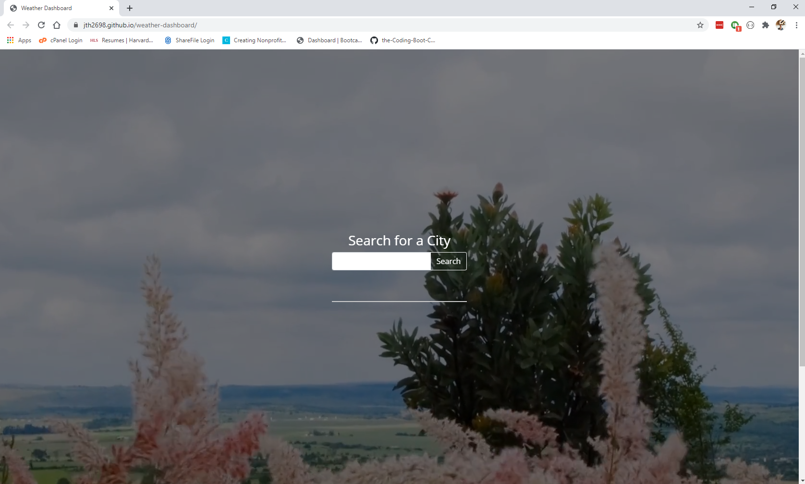

# weather-app

A simple weather app with a responsive background approximating the user's current conditions, current weather conditions, and a 5 day forecast.

## Deployed Application and Screenshot

https://jth2698.github.io/weather-dashboard/

## Build Overview

This app relies heavily on jQuery to dynamically generate all elements on the page

* first, we create an empty array to hold localStorage cities for the search history
* then, if localStorage is not null, we populate the empty array with localStorage cities
* we loop through all the cities in the array to populate search history buttons for all cities
* the loop also adds an on.click to each button to call the weather function based on the data-attribute of the button - the applicable city
* finally, we create the main function to populate the weather on.click of the search button appended to our form - the main element in the base index.html file
* this function uses a series of .ajax calls to openweathermap.org to populate current weather and a five day forecast
* the function also uses the current weather to update the looping background video to approximate current conditions!
* credits for the video idea and the videos themselves are located at the bottom of the main webpage for the application